### 一: kpa扩缩容原理 

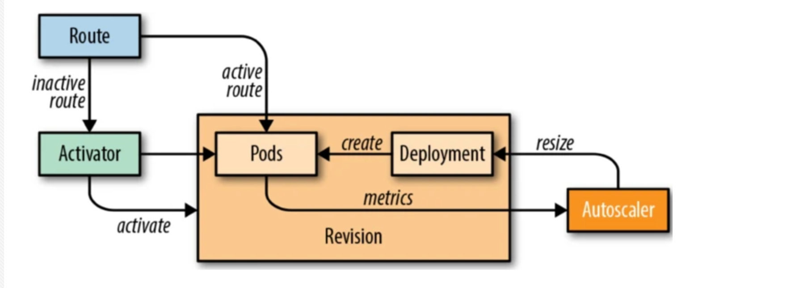 

Knative Serving 为每个 POD 注入 QUEUE 代理容器 (queue-proxy)，该容器负责向 Autoscaler 报告用户容器并发指标。Autoscaler 接收到这些指标之后，会根据并发请求数及相应的算法，调整 Deployment 的 POD 数量，从而实现自动扩缩容。

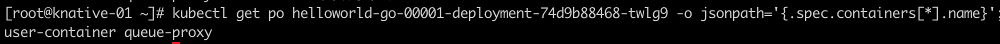

#### 关于queue-proxy

队列代理是一个sidecar容器，与每个用户容器中的用户容器一起部署。发送到应用程序实例的每个请求都首先通过队列代理，因此其名称为“代理”。 

队列代理的主要目的是测量并限制用户应用程序的并发性。如果reversion将并发限制定义为5，则队列代理可确保一次到达应用程序实例的请求不超过5个。如果发送给它的请求更多，它将在本地将它们排队，因此是其名称中的“队列”。队列代理还测量传入的请求负载，并在单独的端口上报告平均并发和每秒请求数。

---

### 二: 安装 Knative Serving 组件

如果只使用到knative原生指标（concurrency` or `rps）进行弹性伸缩配置的话，只需要安装serving组件即可


1. 创建knative资源（镜像地址为gcr，需要科学上网获取）

   ```bash
   kubectl apply -f https://github.com/knative/serving/releases/download/knative-v1.11.0/serving-crds.yaml
   kubectl apply -f https://github.com/knative/serving/releases/download/knative-v1.11.0/serving-core.yaml
   
   ```

2. 确认环境正常

   `kubectl get pods -n knative-serving -owide`

   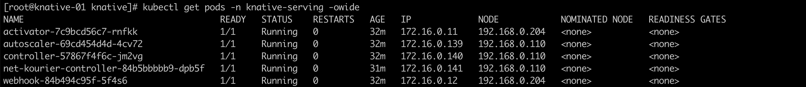

   


---

### 三: 安装knative的网关

1. 网关组件安装(网关的选型基本都是envoy)

   涉及elb的创建

   ```bash
   kubectl apply -f https://github.com/knative/net-kourier/releases/download/knative-v1.11.1/kourier.yaml
   ```

   

2. knative集成网关

   ```bash
   kubectl patch configmap/config-network \
     --namespace knative-serving \
     --type merge \
     --patch '{"data":{"ingress-class":"kourier.ingress.networking.knative.dev"}}'
   
   ```

   

3. 确认部署状态

   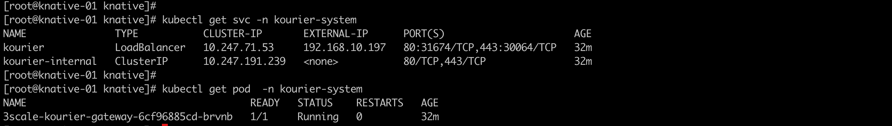

---

DNS配置: 服务发布后，会带有域名信息，配置参考

https://knative.dev/docs/install/yaml-install/serving/install-serving-with-yaml/#configure-dns

Knative服务的默认域名格式为`{route}.{namespace}.{default-example.com}`，其中`{default-example.com}`是默认的域名后缀，通常是`example.com`。默认域名格式可以根据需要进行配置和更改。

`kubectl edit cm config-domain --namespace knative-serving`

---

### 四: 测试demo

1. k-service.yaml

   ```yaml
   apiVersion: serving.knative.dev/v1
   kind: Service
   metadata:
     name: helloworld-go
   spec:
     template:
       metadata:
         labels:
           app: autoscale-go
         annotations:
           autoscaling.knative.dev/target: "10"
           autoscaling.knative.dev/minScale: "0"
           autoscaling.knative.dev/maxScale: "10"
       spec:
         containers:
         - image: sbawaska/helloworld-go
           env:
           - name: TARGET
             value: "Knative"
   ```

   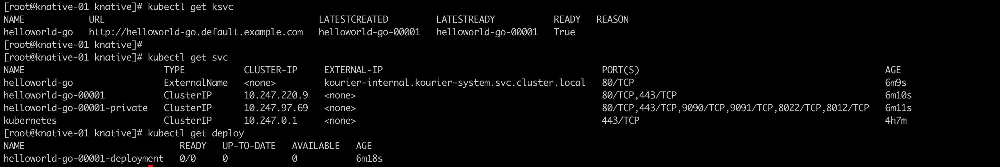

2. 访问测试

   Linux 集群节点上测试 需要将网关ip地址设置到对应的域名解析

   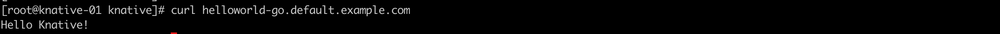

   一旦有流量进来，立马触发动态伸缩

   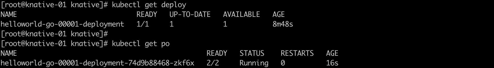

   

   如果不进行访问，流量为空。负载会自动伸缩至零

   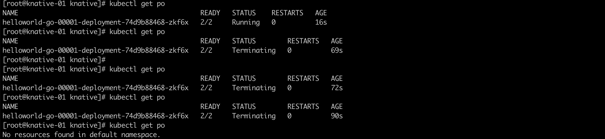  

3. 如果不想伸缩至零

   a. 修改ksvc的annotations参数: autoscaling.knative.dev/minScale: "1"

   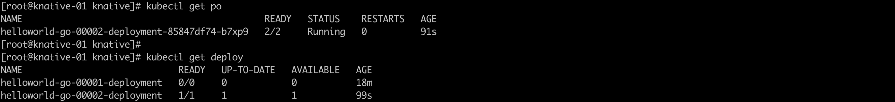 

   将ksvc参数修改后，重新发布，会部署一个修订版的负载，我们发现这个负载即使流量为空，也会保持最少一个负载

   

   b. 修改config-autoscaler配置: 将 enable-scale-to-zero: "false"

   默认的参数为:

   ```yaml
   apiVersion: v1
   kind: ConfigMap
   metadata:
    name: config-autoscaler
    namespace: knative-serving
   data:
    container-concurrency-target-default: "100"  # 
    container-concurrency-target-percentage: "0.7" # 并发因子，实际扩缩容并发数=target*container-concurrency-target-percentage
    enable-scale-to-zero: "true"  # 如果需要缩放到零，确保该参数为true。默认开启 
    max-scale-up-rate: "1000"     #最大扩容速率
    max-scale-down-rate: "2"      #最小缩容速率
    panic-window-percentage: "10"  #恐慌模式的时间窗口，计算方式为稳定窗口的百分比
    panic-threshold-percentage: "200"  # 容器并发目标的百分比，此时在恐慌窗口内进入恐慌模式
    scale-to-zero-grace-period: "30s"  #将实例缩容到零时保持运行的时间
    scale-to-zero-pod-retention-period: "0s"
    stable-window: "60s" 
    target-burst-capacity: "200" 
    requests-per-second-target-default: "200"
   ```

   ⚠️:ksvc配置中的 annoation的优先级要比 configmap中配置优先级要高

   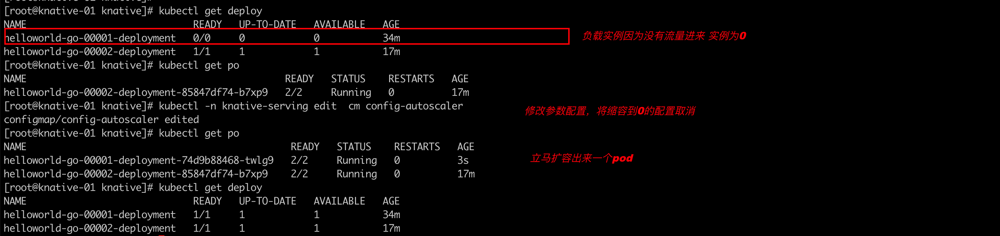


---

### 五: KPA弹性配置说明

1. knative/kpa原生支持的流量指标 : `concurrency` 和 `rps` ,默认根据并发数concurrency进行弹性伸缩

   并发数concurrency是指系统同时能处理的请求数量，这个也是反应了系统的负载能力。

   RPS（Request per second），每秒请求数

   

2. 如何配置使用指定指标: 在ksvc中的annotioan指定: autoscaling.knative.dev/metric: concurrency(rps)

   例如:

   ```yaml
   apiVersion: serving.knative.dev/v1
   kind: Service
   metadata:
     name: helloworld-go
     namespace: default
   spec:
     template:
       metadata:
         annotations:
           autoscaling.knative.dev/metric: "concurrency"
   ```

   

3. 如何设置target值

   target值为期待选定的指标值维持在多少，高于这个会扩容，低于该值会缩容。不设置的话默认是100

   例如:

   ```yaml
   apiVersion: serving.knative.dev/v1
   kind: Service
   metadata:
     name: helloworld-go
     namespace: default
   spec:
     template:
       metadata:
         annotations:
           autoscaling.knative.dev/target: "50"
   ```

   

4. 如何设置扩缩容的上下限边界

   如果开启了scale-to-zero特性，下限默认是0，否则是1。当然也可以自己指定: `autoscaling.knative.dev/min-scale: xxx`

   上线如果不设置，默认是0.表示不限制

   ```yaml
   apiVersion: serving.knative.dev/v1
   kind: Service
   metadata:
     name: helloworld-go
     namespace: default
   spec:
     template:
       metadata:
         annotations:
           autoscaling.knative.dev/min-scale: "1"  #下限
           autoscaling.knative.dev/max-scale: "3"  #上限
       spec:
         containers:
           - image: ghcr.io/knative/helloworld-go:latest
   
   ```

   ⚠️: 在上下限的边界配置中还有一个 `autoscaling.knative.dev/initial-scale: "1" ` 的配置。默认是1，表示ksvc创建的同时，立马创建初始目标设置的实例值


5. 谨慎缩容

   在流量减少时，系统决策缩容需要考虑的一个延迟缩容时间。该项配置，可以防止流量突增(下一个流量高峰)的时候负载实例冷启动的时间。不配置默认是0s，配置区间为0s～1h

   ```yaml
   apiVersion: serving.knative.dev/v1
   kind: Service
   metadata:
     name: helloworld-go
     namespace: default
   spec:
     template:
       metadata:
         annotations:
           autoscaling.knative.dev/scale-down-delay: "5m"
       spec:
         containers:
           - image: ghcr.io/knative/helloworld-go:latest
   ```

   

---

### 六: 扩缩容算法

Knative 算法参考: https://github.com/knative/serving/tree/main/docs/scaling

Autoscaler 基于每个 POD 的平均请求数（并发数）进行扩所容处理。默认并发数为 100。

`want = concurrencyInSystem/targetConcurrencyPerInstance`

使用hey命令进行压测:

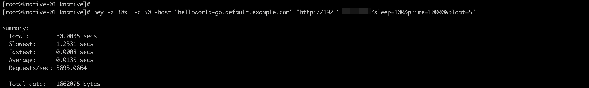 

可以看到负载扩容成功: ksvc中配置的`autoscaling.knative.dev/target: "10"`,并发数为:50 ==> 计算可得扩容pod实例为5

⚠️: 压测工具的差异或者lb的配置，可能会导致扩容的实例出现小范围偏差，总体不影响扩容选择

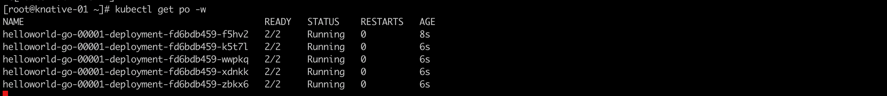 

停止压测后，负载缩容成功

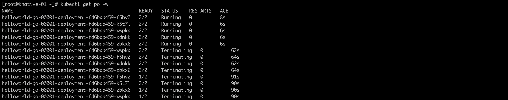

提高并发数进行压测: 此时并发数设置为200，触发弹性操作时，实例将不少于10

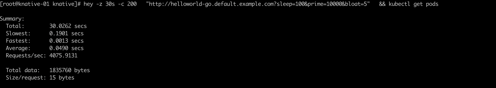

因为设置了最大实例不超过10的边界，所以实例最多只有10个 

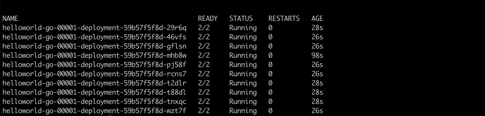 